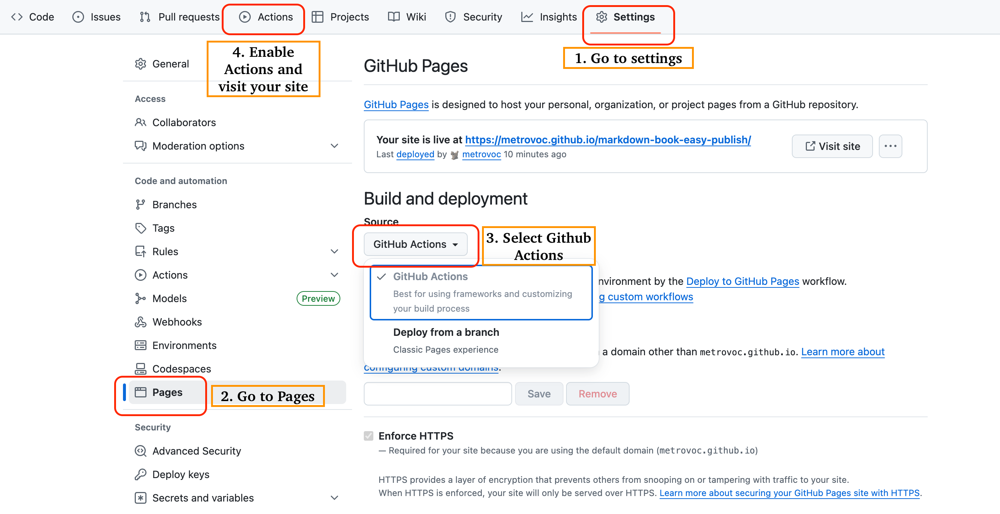

# Markdown Book Publisher

A minimal, beautiful, and powerful tool for publishing books from Markdown files to GitHub Pages. Create stunning e-books with just a few markdown files!

## ✨ Features

- 🎨 **Beautiful Design** - Clean, modern interface with professional typography
- 📱 **Responsive** - Perfect reading experience on desktop, tablet, and mobile
- 🌓 **Dark Mode** - Auto-switching dark/light themes
- 📖 **Reader-Friendly** - Customizable fonts, sizes, and reading preferences
- 🧭 **Smart Navigation** - Table of contents, chapter navigation, and progress tracking
- 🔄 **Progress Sync** - Remembers where you left off reading
- 🚀 **Zero Config** - Works out of the box with minimal setup
- 📦 **GitHub Pages** - Automatic deployment with GitHub Actions

## 🚀 Quick Start

### ⚡ Super Simple Way (Recommended)



1. **Fork this repository** to your GitHub account
2. **Enable GitHub Pages** in repository settings:
   - Go to Settings → Pages
   - Select "GitHub Actions" as source
3. **Add your markdown files** to the `contents` folder:
   ```
   contents/
   ├── chapter1.md     # Your first chapter
   ├── chapter2.md     # Your second chapter
   ├── chapter3.md     # Your third chapter
   └── ...
   ```
4. **Commit and push** - Your book will be automatically published!

**That's it!** No configuration files needed. The system will:

- ✅ Automatically detect **ANY** markdown files (custom filenames supported!)
- ✅ Smart sorting with number recognition and Chinese support
- ✅ Extract chapter titles from your `# headings`
- ✅ Generate table of contents automatically during build
- ✅ Deploy to GitHub Pages automatically

### 📁 Supported Filenames

The auto-detection works with **ANY** markdown filename:

- ✅ `chapter1.md`, `ch1.md`, `01.md` (numbered)
- ✅ `我的故事.md`, `第一章.md` (Chinese)
- ✅ `love-story.md`, `final-battle.md` (custom names)
- ✅ `introduction.md`, `epilogue.md` (special chapters)

### 📝 Optional Configuration

- Add `config.json` to customize book title, author, and description
- Add `index.json` to control exact chapter order

## 📁 Project Structure

```
├── contents/              # Your book content
│   ├── config.json       # Book metadata
│   ├── index.json        # Chapter order (optional)
│   ├── chapter1.md       # Your chapters
│   ├── chapter2.md
│   └── ...
├── src/                  # Source code
├── .github/workflows/    # GitHub Actions
└── package.json         # Dependencies
```

## 📖 Writing Your Book

### Book Configuration (`config.json`)

```json
{
  "title": "Your Book Title",
  "author": "Your Name",
  "description": "A brief description of your book",
  "theme": "auto"
}
```

### Chapter Organization (`index.json`)

```json
{
  "files": ["introduction.md", "chapter1.md", "chapter2.md", "conclusion.md"]
}
```

If you don't provide `index.json`, the system will automatically detect files with common patterns like `chapter1.md`, `ch1.md`, `01.md`, etc.

### Markdown Features

Full support for:

- Headers, lists, and basic formatting
- Code blocks with syntax highlighting
- Tables and blockquotes
- Links and images
- GitHub Flavored Markdown extensions

## 🎨 Customization

### Reader Settings

Users can customize:

- **Theme**: Light, dark, or auto (follows system preference)
- **Font Size**: Small, medium, or large
- **Font Family**: Serif, sans-serif, or monospace
- **Line Height**: Adjustable for optimal reading
- **Reading Width**: Narrow to full-width options

### Styling

The project uses:

- **Tailwind CSS** for styling
- **shadcn/ui** components for consistent design
- **CSS variables** for easy theme customization

## 🛠️ Development

### Prerequisites

- Node.js 18+
- npm or yarn

### Local Development

```bash
# Clone the repository
git clone https://github.com/yourusername/markdown-book-easy-publish.git

# Install dependencies
npm install

# Start development server
npm run dev

# Build for production
npm run build
```

### Tech Stack

- **React 18** with TypeScript
- **Vite** for fast development and building
- **Tailwind CSS** for styling
- **react-markdown** for markdown rendering
- **GitHub Actions** for deployment

## 📚 Examples

This repository includes a sample book demonstrating all features. After setup, you'll see:

- Chapter navigation
- Table of contents
- Reading preferences
- Progress tracking
- Responsive design

## 🤝 Contributing

Contributions are welcome! Please feel free to submit a Pull Request. For major changes, please open an issue first to discuss what you would like to change.

## 📄 License

This project is open source and available under the [MIT License](LICENSE).

## 🙏 Acknowledgments

- Built with [React](https://reactjs.org/) and [Vite](https://vitejs.dev/)
- UI components from [shadcn/ui](https://ui.shadcn.com/)
- Styled with [Tailwind CSS](https://tailwindcss.com/)
- Deployed with [GitHub Pages](https://pages.github.com/)

---

**Happy writing!** 📚✨

Create your book today and share your stories with the world.
